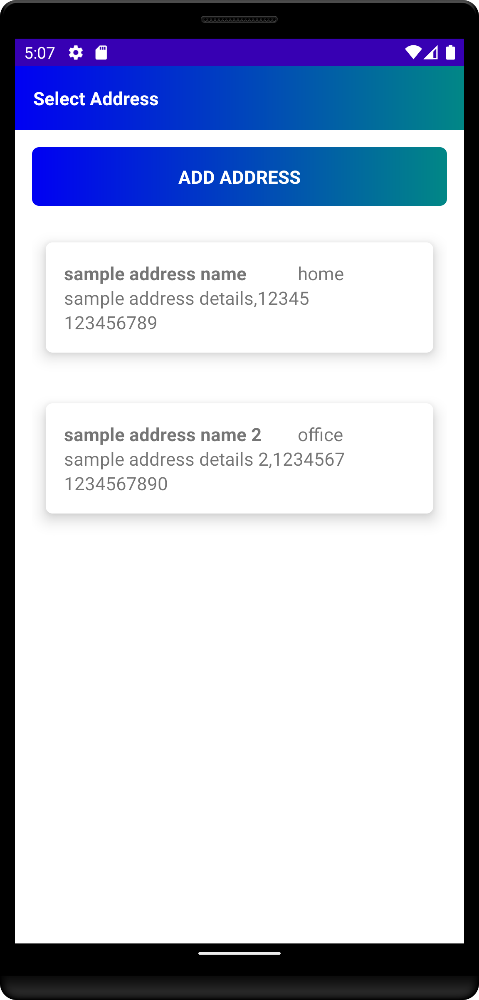
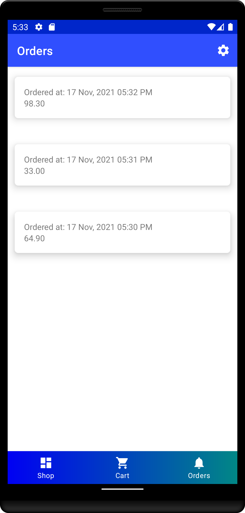

# ShopPal

## Description

ShopPal is an e-commerce based android application which follows MVC architechture.
E-commerce or electronic commerce actually means the use of an electronic medium for commercial transactions, but it is commonly used to refer to selling products and services over the internet to consumers or other businesses.
With the advent of internet, e-commerce has become popular. There are a lot of e-commerce applications in market now. Flipkart and amazon are one of the most popular android e-commerce application in indian market.

ShopPal implements firebase authentication, firebase cloud firestore, firebase storage and firebase realtime database. It uses firebase authentication to login and register user. User profile details are stored in firebase cloud firestore. All the products and status of placed orders are stored in firebase realtime database. Firebase storage is being used to store user profile images. Room persistence library is being used for local caching and glide library is used for image loading and caching.

So, the primary motivation in building this application is to make use of firebase technologies, room persistence library and glide library to build e-commerce app.

## Application Screenshots

* Splash Screen:
  -

   
   

* The user will be presented with the authentication screen from which the user can login, register and reset password.

  - **Login Screen:** The user can login by entering proper login credentials. 
  

  
  

  
  - **Register Screen:** A new account can be created by entering all the necessary details.
  

  
  

  - **Forgot Password Screen:**  Password can be reset by sending reset email link after entering your account's email address.
  

  
  

* After authentication or registeration of user, the user will be presented with Dashboard Screen which contains options to choose shopping items, cart items and status of orders placed.

  - **Shopping Items Screen:** The user can choose shopping item to buy or add to cart. It has search functionality to search a particular product. It also displays various item categories to get items of a particular category.
  

  
  

  
  - **Item Overview Screen:** It shows details of the shopping item. The user can buy or add to cart.
  

  
  

  
  - **Cart Items Screen:** It implements cart functionality.
  

   &nbsp; &nbsp; &nbsp; &nbsp; &nbsp;
  
  

  
  - **Select Address Screen:** The user can select address to buy product item.
  

  
  

  - **Add Address Screen:** The user can add new address that can be selected by the user to buy product item/items.
  

  
  

  - **Checkout Screen:** It shows details of the product/products to be bought, recipent address, items reciept and payment mode. The user can confirm details to place order.
  

  
  

  
  - **Order Status Items Screen:** It shows status of various orders placed.
  

  
  

  
  - **Order Item Screen:** It shows details of the order placed. It contains all the necessary details of the order.
  

  
  

* Settings Screen: The user can edit profile details, see profile details and logout in the settings screen after clicking on settings icon on the dashboard.
  

  
  

* User Profile Details Screen: The user can edit profile details in the user profile details screen.
  

  
  

## Code Structure

As the name implies MVC pattern has three layers, which are:

* Model: Represents the business layer of the application. 
   Our application consists of model classes such as Address, Order, Order Detail, Order Receipt, Product and User. 
* View: Defines the presentation of the application
   The user can login via login activity and register via register activity. The user can choose shopping item to buy from shopping items fragment. Orders fragment shows status of orders. Cart fragment implements cart functionality. Details of the item can be seen in item overview activity. The item/items can be bought by the user via Select Address Activity and Checkout Activity. The user can see the status of order in order item activity.  
* Controller: Manages the flow of the application
   Our application consists of a lot of adapters which deal with list of data and update recycler views. Data is fetched via firebase api or room persistence library.
 
 ## Package Structure
 
    com.example.shoppal                # Root Package
      .
      ├── activities                   # Contains various activities to login, register, add address, select address, implement cart functionality, checkout order, view shopping items, reset password, view details of the item, show status of the order, view/edit profile details and logout.
      ├── adapters                     # Contains adapters to manage the flow of the application.
      ├── firebase                     # Implements firebase authentication, firebase cloud firestore, firebase realtime database and firebase storage.  
      ├── fragments                    # Contains CartFragment, OrdersFragment and ShoppingItemsFragment to implement cart functionality, display status of orders and display shopping items.
      ├── interfaces                   # Has interface which contains setUserDetails method.
      ├── models                       # Contains various model classes to implement business layer of the application.
      ├── room                         # Implements room persistence library related logic.
      └── utils                        # Contains Constants/Tags
      
## Technologies and Libraries

- [Kotlin](https://kotlinlang.org/) - Official programming language for Android development.
- [Firebase Authentication](https://firebase.google.com/docs/auth) - Firebase Authentication provides backend services, easy-to-use SDKs, and ready-made UI libraries to authenticate users to your app. It supports authentication using passwords, phone numbers, popular federated identity providers like Google, Facebook and Twitter, and more.
- [Firebase Cloud Firestore](https://firebase.google.com/docs/firestore) - Cloud Firestore is a flexible, scalable database for mobile, web, and server development from Firebase and Google Cloud.
- [Firebase Realtime Database](https://firebase.google.com/docs/database) - The Firebase Realtime Database is a cloud-hosted database. Data is stored as JSON and synchronized in realtime to every connected client.
- [Firebase Cloud Storage](https://firebase.google.com/docs/firestore) - Cloud Firestore is a flexible, scalable database for mobile, web, and server development from Firebase and Google Cloud. Like Firebase Realtime Database, it keeps your data in sync across client apps through realtime listeners and offers offline support for mobile and web so you can build responsive apps that work regardless of network latency or Internet connectivity. Cloud Firestore also offers seamless integration with other Firebase and Google Cloud products, including Cloud Functions.
- [Glide](https://bumptech.github.io/glide/) - Glide is a fast and efficient image loading library for Android focused on smooth scrolling. Glide offers an easy to use API, a performant and extensible resource decoding pipeline and automatic resource pooling.
- [Room](https://developer.android.com/topic/libraries/architecture/room) - The Room persistence library provides an abstraction layer over SQLite to allow fluent database access while harnessing the full power of SQLite.

## Built With

* Android Studio

## Author
* <a href="https://github.com/aikansh2001yadav"> **Aikansh Yadav** </a>
